# Chitram Codebase Analysis

**A Comprehensive Analysis from Architecture, Development, and Product Perspectives**

*Last Updated: 2026-01-06*
*Repository: https://github.com/abhi10/chitram*
*Project Name: Chitram (చిత్రం - Image/Picture in Telugu)*

---

## Table of Contents

- [Executive Summary](#executive-summary)
- [Project Overview](#project-overview)
- [Architecture Deep Dive](#architecture-deep-dive)
- [Technology Stack](#technology-stack)
- [Design Patterns & Principles](#design-patterns--principles)
- [Data Models & Database Design](#data-models--database-design)
- [API Design](#api-design)
- [Service Layer Architecture](#service-layer-architecture)
- [Security Implementation](#security-implementation)
- [Testing Strategy](#testing-strategy)
- [DevOps & Deployment](#devops--deployment)
- [Product Perspective](#product-perspective)
- [Future Roadmap](#future-roadmap)
- [Architecture Decision Records](#architecture-decision-records)
- [Code Quality & Standards](#code-quality--standards)

---

## Executive Summary

Chitram is a production-ready image hosting service built as a learning platform for distributed systems. The project demonstrates modern Python backend development practices with FastAPI, featuring:

- **225+ passing tests** with comprehensive coverage
- **Production deployment** on DigitalOcean (https://chitram.io)
- **6 completed phases** of incremental development
- **15 Architecture Decision Records** documenting key choices
- **Enterprise-grade patterns**: Strategy Pattern, Dependency Injection, Cache-Aside

### Key Metrics

| Metric | Value |
|--------|-------|
| Test Count | 225+ |
| Code Coverage | >80% |
| ADRs | 15 |
| API Endpoints | 12 |
| Phases Complete | 3 (of 6) |

---

## Project Overview

### Mission

Chitram serves as a practical learning platform for distributed systems concepts while delivering a functional image hosting service. It prioritizes:

1. **Educational Value**: Each phase introduces new distributed systems concepts
2. **Production Quality**: Real deployment with proper security and monitoring
3. **Incremental Complexity**: Start simple, add sophistication progressively

### Phase Progression

```mermaid
gantt
    title Chitram Development Phases
    dateFormat YYYY-MM-DD

    section Foundation
    Phase 1 Lean :done, p1, 2025-12-13, 2025-12-24
    Phase 1.5 :done, p15, 2025-12-31, 2025-12-31

    section Features
    Phase 2A Auth :done, p2a, 2026-01-02, 2026-01-03
    Phase 2B Thumbnails :done, p2b, 2026-01-03, 2026-01-03

    section UI
    Phase 3 Web UI :done, p3, 2026-01-03, 2026-01-03

    section Future
    Phase 4 Advanced :future, p4, 2026-02-01, 2026-03-01
    Phase 5 Scaling :future, p5, 2026-03-01, 2026-04-01
    Phase 6 Observability :future, p6, 2026-04-01, 2026-05-01
```

---

## Architecture Deep Dive

### High-Level System Architecture

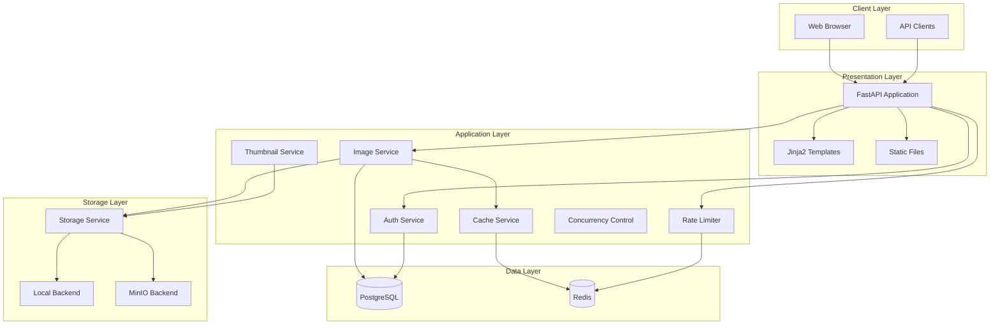

### Directory Structure

```
image-hosting-app/
├── backend/
│   ├── app/
│   │   ├── __init__.py
│   │   ├── main.py              # FastAPI app entry, lifespan management
│   │   ├── config.py            # Pydantic settings
│   │   ├── database.py          # SQLAlchemy async setup
│   │   ├── api/                  # Route handlers
│   │   │   ├── __init__.py
│   │   │   ├── auth.py          # Authentication endpoints
│   │   │   ├── dependencies.py  # Shared FastAPI dependencies
│   │   │   ├── health.py        # Health check endpoint
│   │   │   ├── images.py        # Image CRUD endpoints
│   │   │   └── web.py           # Web UI routes
│   │   ├── models/               # SQLAlchemy models
│   │   │   ├── __init__.py
│   │   │   ├── image.py         # Image model
│   │   │   └── user.py          # User model
│   │   ├── schemas/              # Pydantic schemas
│   │   │   ├── __init__.py
│   │   │   ├── auth.py          # Auth request/response
│   │   │   ├── error.py         # Structured errors
│   │   │   └── image.py         # Image request/response
│   │   ├── services/             # Business logic
│   │   │   ├── __init__.py
│   │   │   ├── auth_service.py      # JWT, password hashing
│   │   │   ├── cache_service.py     # Redis cache
│   │   │   ├── concurrency.py       # Upload semaphore
│   │   │   ├── image_service.py     # Image operations
│   │   │   ├── rate_limiter.py      # Request rate limiting
│   │   │   ├── storage_service.py   # Storage abstraction
│   │   │   └── thumbnail_service.py # Background thumbnails
│   │   ├── templates/            # Jinja2 templates
│   │   ├── static/               # CSS, JS, images
│   │   └── utils/                # Helpers
│   │       ├── __init__.py
│   │       └── validation.py    # File validation
│   ├── tests/                    # Test suite
│   │   ├── conftest.py          # Shared fixtures
│   │   ├── api/                 # API tests
│   │   ├── unit/                # Unit tests
│   │   └── integration/         # Integration tests
│   ├── alembic/                 # Database migrations
│   └── pyproject.toml           # Dependencies & config
├── deploy/                       # Production deployment
│   ├── docker-compose.yml
│   ├── Caddyfile
│   └── .env.production.example
├── docs/                         # Documentation
│   ├── adr/                     # Architecture Decision Records
│   ├── deployment/              # Deployment guides
│   └── requirements/            # Phase requirements
├── scripts/                      # Automation scripts
│   ├── backup.sh
│   └── restore.sh
└── .github/workflows/            # CI/CD pipelines
```

### Request Flow

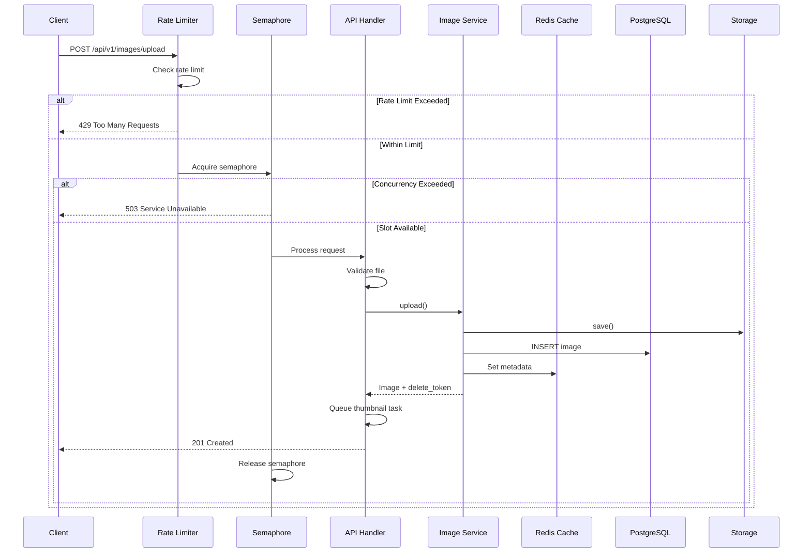

---

## Technology Stack

### Core Technologies

| Layer | Technology | Version | Purpose |
|-------|------------|---------|---------|
| **Framework** | FastAPI | >=0.115.0 | Async web framework |
| **Runtime** | Python | >=3.11 | Language runtime |
| **Database** | PostgreSQL | 15+ | Primary data store |
| **ORM** | SQLAlchemy | >=2.0.35 | Async database access |
| **Migrations** | Alembic | >=1.14.0 | Schema versioning |
| **Cache** | Redis | >=5.2.0 | Caching & rate limiting |
| **Storage** | MinIO | - | S3-compatible object storage |
| **Templates** | Jinja2 | >=3.1.0 | Server-side rendering |
| **Auth** | JWT (python-jose) | >=3.5.0 | Token-based auth |

### Development Tools

| Tool | Purpose |
|------|---------|
| **uv** | Package management (replaces pip) |
| **pytest** | Testing framework |
| **ruff** | Linting |
| **black** | Code formatting |
| **pre-commit** | Git hooks |
| **mypy** | Type checking |

### Dependency Breakdown

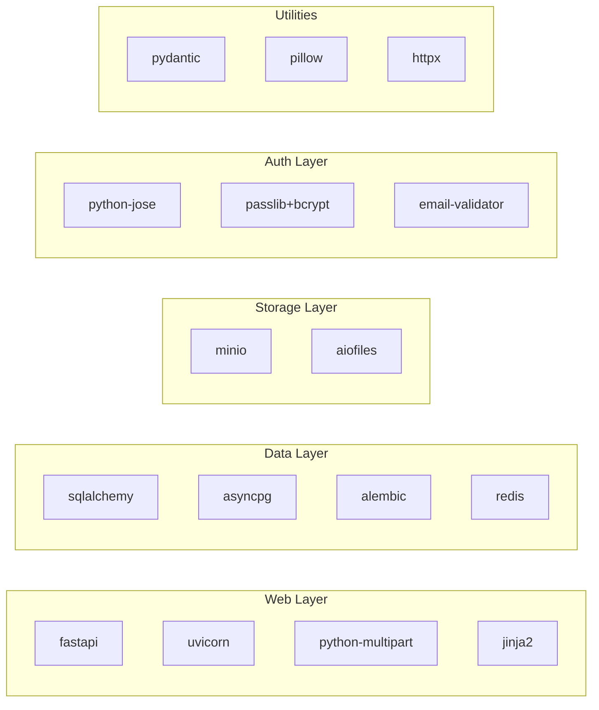

---

## Design Patterns & Principles

### 1. Strategy Pattern (Storage Service)

The storage system uses the Strategy Pattern to enable seamless switching between backends:

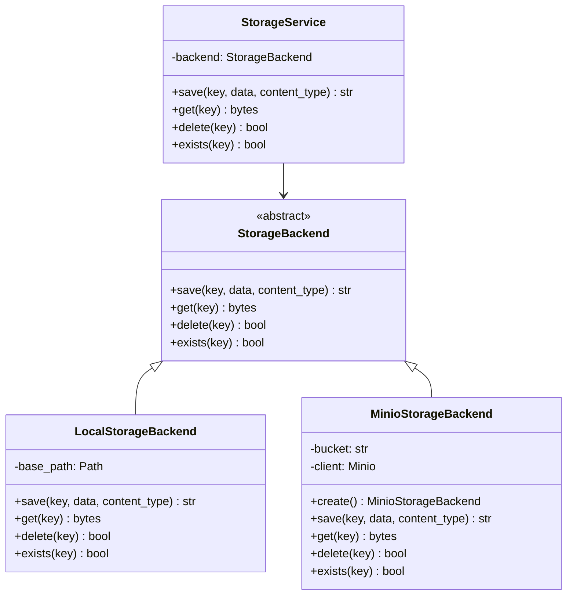

**Implementation Highlights:**
- Abstract base class defines the contract
- Concrete implementations for local filesystem and MinIO
- `StorageService` facade provides graceful degradation
- Configuration-based backend selection at startup

### 2. Dependency Injection (FastAPI Depends)

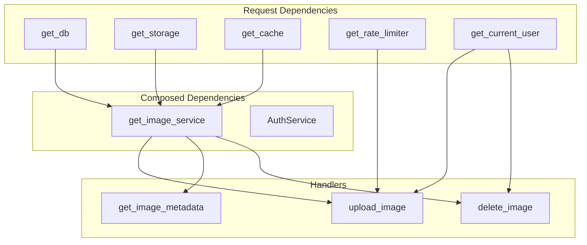

### 3. Cache-Aside Pattern (Redis Caching)

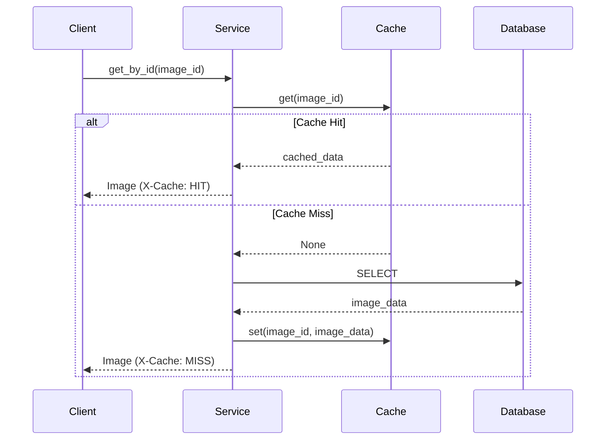

**Key Features:**
- TTL-based expiration (default: 1 hour)
- Cache invalidation on delete
- X-Cache header for debugging
- Graceful degradation when Redis unavailable

### 4. Lifespan Pattern (Application Lifecycle)

```python
@asynccontextmanager
async def lifespan(app: FastAPI) -> AsyncGenerator[None, None]:
    # Startup: Initialize all dependencies
    await init_db()
    app.state.storage = StorageService(backend=...)
    app.state.cache = CacheService(...)
    app.state.rate_limiter = RateLimiter(...)
    app.state.thumbnail_service = ThumbnailService(...)

    yield  # Application runs

    # Shutdown: Cleanup
    await cache_service.close()
    await close_db()
```

### 5. Test Dependency Container (ADR-0014)

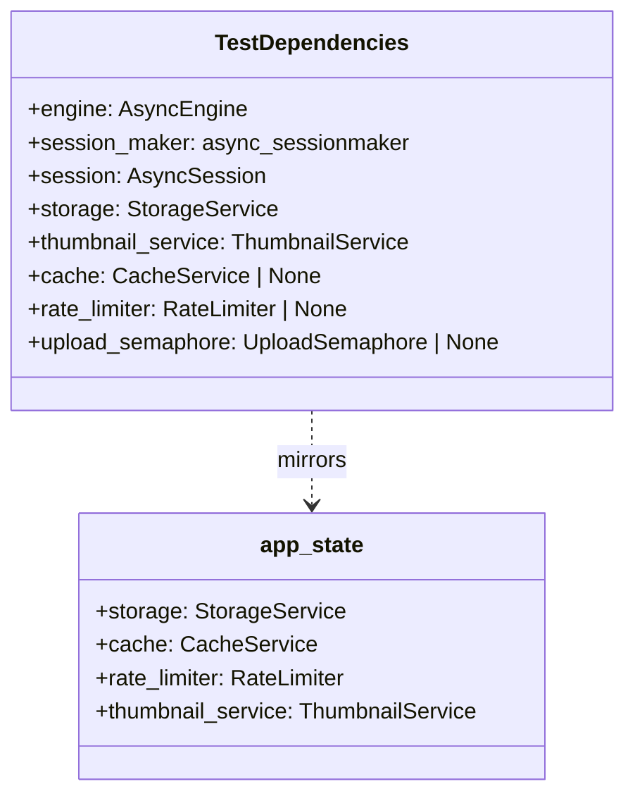

---

## Data Models & Database Design

### Entity Relationship Diagram

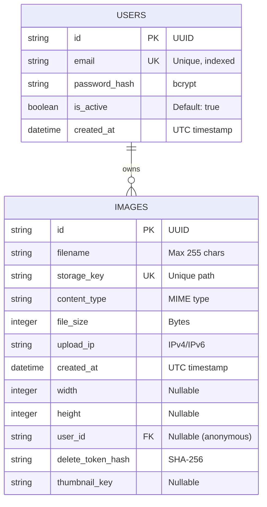

### SQLAlchemy Models

**User Model:**
```python
class User(Base):
    __tablename__ = "users"

    id: Mapped[str]           # UUID primary key
    email: Mapped[str]        # Unique, indexed
    password_hash: Mapped[str] # bcrypt hash
    is_active: Mapped[bool]   # Account status
    created_at: Mapped[datetime]
```

**Image Model:**
```python
class Image(Base):
    __tablename__ = "images"

    id: Mapped[str]           # UUID primary key
    filename: Mapped[str]     # Original filename (sanitized)
    storage_key: Mapped[str]  # Unique storage path
    content_type: Mapped[str] # image/jpeg, image/png
    file_size: Mapped[int]    # Size in bytes
    upload_ip: Mapped[str]    # Client IP
    created_at: Mapped[datetime]
    width: Mapped[int | None] # Image dimensions
    height: Mapped[int | None]
    user_id: Mapped[str | None]  # FK to users (nullable)
    delete_token_hash: Mapped[str | None]  # For anonymous
    thumbnail_key: Mapped[str | None]  # Generated async
```

### Migration Strategy

Alembic manages schema evolution:

```
alembic/versions/
├── d2dc1766a59c_initial_schema.py        # 7 columns
├── a11aa549249d_add_dimensions.py        # width, height
├── 2f6a8fb30700_add_users_ownership.py   # users table, FKs
└── 42cb2a9fa7a2_add_thumbnail_key.py     # thumbnail support
```

---

## API Design

### RESTful Endpoints

```mermaid
graph LR
    subgraph "Public Endpoints"
        HEALTH[GET /health]
        DOCS[GET /docs]
    end

    subgraph "Auth Endpoints"
        REGISTER[POST /api/v1/auth/register]
        LOGIN[POST /api/v1/auth/login]
        TOKEN[POST /api/v1/auth/token]
        ME[GET /api/v1/auth/me]
    end

    subgraph "Image Endpoints"
        UPLOAD[POST /api/v1/images/upload]
        META[GET /api/v1/images/{id}]
        FILE[GET /api/v1/images/{id}/file]
        THUMB[GET /api/v1/images/{id}/thumbnail]
        DELETE[DELETE /api/v1/images/{id}]
    end

    subgraph "Web UI"
        HOME[GET /]
        IMG_PAGE[GET /images/{id}]
        UPLOAD_PAGE[GET /upload]
        LOGIN_PAGE[GET /login]
        REGISTER_PAGE[GET /register]
        MY_IMAGES[GET /my-images]
    end
```

### API Specification

| Endpoint | Method | Auth | Description |
|----------|--------|------|-------------|
| `/health` | GET | No | Health check with service status |
| `/api/v1/auth/register` | POST | No | Create user account |
| `/api/v1/auth/login` | POST | No | Get JWT token |
| `/api/v1/auth/token` | POST | No | OAuth2 token endpoint |
| `/api/v1/auth/me` | GET | Yes | Current user profile |
| `/api/v1/images/upload` | POST | Yes | Upload image (JPEG/PNG, max 5MB) |
| `/api/v1/images/{id}` | GET | No | Get image metadata |
| `/api/v1/images/{id}/file` | GET | No | Download image file |
| `/api/v1/images/{id}/thumbnail` | GET | No | Get 300px thumbnail |
| `/api/v1/images/{id}` | DELETE | Yes* | Delete image (*owner or token) |

### Request/Response Schemas

**Upload Response:**
```json
{
  "id": "uuid",
  "filename": "image.jpg",
  "content_type": "image/jpeg",
  "file_size": 102400,
  "url": "/api/v1/images/{id}/file",
  "created_at": "2026-01-06T12:00:00Z",
  "width": 1920,
  "height": 1080,
  "delete_token": "abc123...",  // Only for anonymous
  "thumbnail_ready": false,
  "thumbnail_url": null
}
```

**Error Response (Structured):**
```json
{
  "error": {
    "code": "INVALID_FILE_FORMAT",
    "message": "Only JPEG and PNG formats are supported",
    "details": {
      "received": "application/pdf",
      "allowed": ["image/jpeg", "image/png"]
    }
  }
}
```

### Error Codes

| Code | HTTP Status | Description |
|------|-------------|-------------|
| `INVALID_FILE_FORMAT` | 400 | Not JPEG or PNG |
| `FILE_TOO_LARGE` | 400 | Exceeds 5MB limit |
| `INVALID_REQUEST` | 400 | Malformed request |
| `IMAGE_NOT_FOUND` | 404 | Image ID doesn't exist |
| `THUMBNAIL_NOT_READY` | 404 | Thumbnail not generated yet |
| `RATE_LIMIT_EXCEEDED` | 429 | Too many requests |
| `SERVICE_UNAVAILABLE` | 503 | Server busy/unavailable |
| `INTERNAL_ERROR` | 500 | Unexpected error |

---

## Service Layer Architecture

### Service Responsibilities

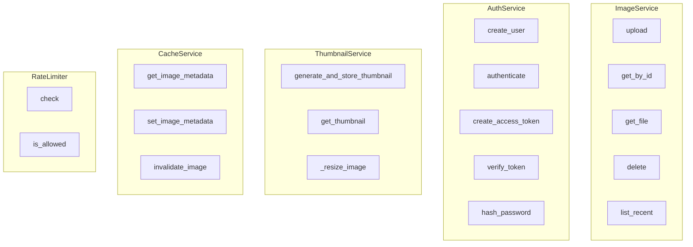

### ImageService Flow

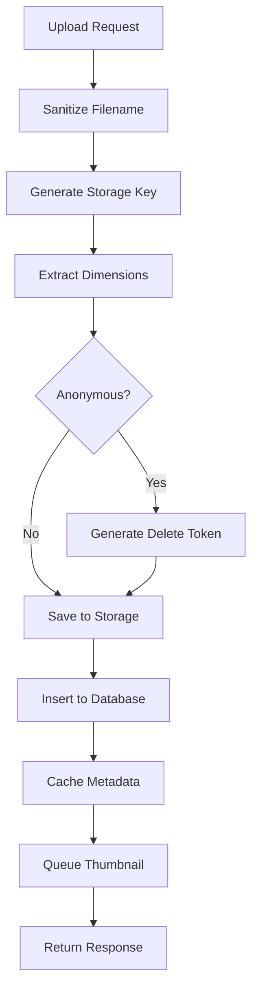

### Background Task Processing

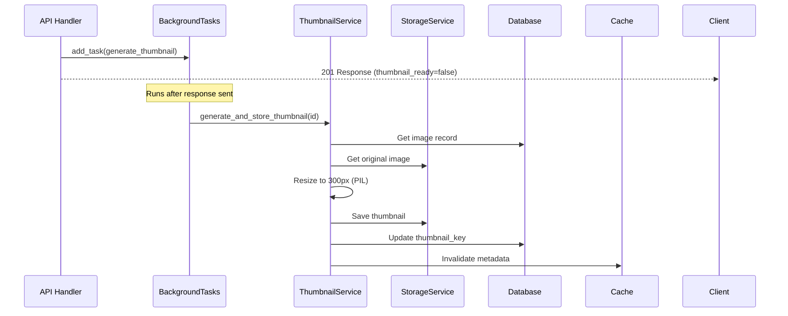

---

## Security Implementation

### Authentication Flow

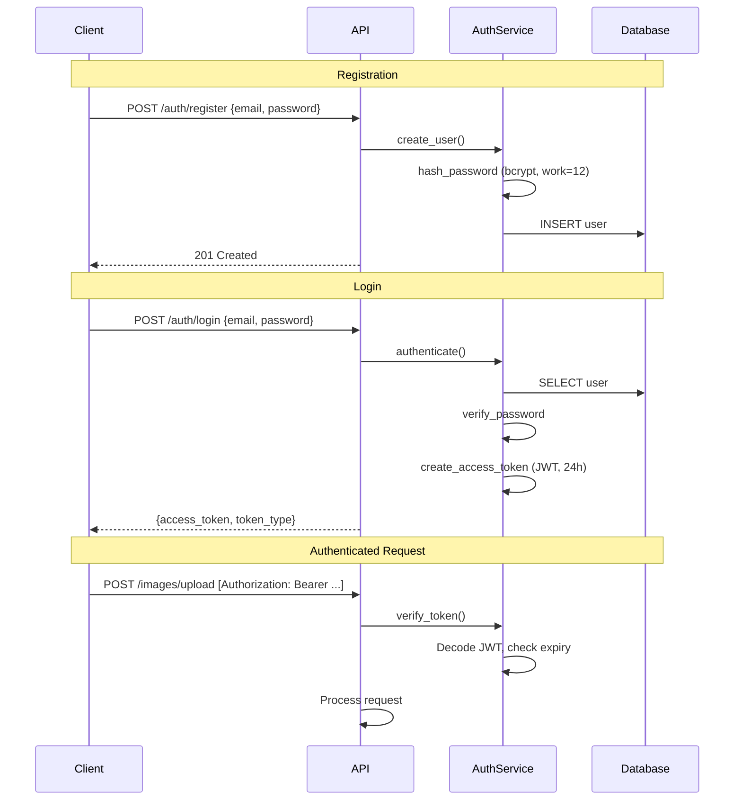

### Security Features

| Feature | Implementation | Details |
|---------|----------------|---------|
| **Password Hashing** | bcrypt | Work factor 12 (200-400ms) |
| **JWT Tokens** | HS256 | 24-hour expiry, signed |
| **Delete Tokens** | secrets.token_urlsafe(32) | SHA-256 hash stored |
| **Token Comparison** | secrets.compare_digest | Timing-safe |
| **Rate Limiting** | Redis sliding window | 10 req/min per IP |
| **Concurrency** | asyncio.Semaphore | 10 concurrent uploads |
| **File Validation** | Magic bytes | Not just Content-Type |
| **Path Traversal** | Sanitization | Remove /, \, null bytes |

### OWASP Alignment

- **A01 (Broken Access Control)**: Ownership verification
- **A02 (Cryptographic Failures)**: bcrypt, secure tokens
- **A03 (Injection)**: Parameterized queries
- **A05 (Security Misconfiguration)**: Secure defaults
- **A07 (Auth Failures)**: No user enumeration

---

## Testing Strategy

### Test Pyramid

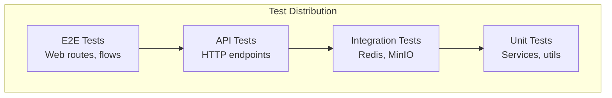

### Test Organization

```
tests/
├── conftest.py              # TestDependencies container
├── api/                     # HTTP endpoint tests
│   ├── test_images.py       # Image CRUD
│   ├── test_images_auth.py  # Auth flows
│   ├── test_auth.py         # Auth endpoints
│   └── test_thumbnails.py   # Thumbnail API
├── unit/                    # Isolated unit tests
│   ├── test_auth_service.py
│   ├── test_cache_service.py
│   ├── test_rate_limiter.py
│   ├── test_concurrency.py
│   ├── test_thumbnail_service.py
│   └── test_performance_fixes.py
└── integration/             # External service tests
    ├── test_redis_integration.py
    ├── test_minio_integration.py
    └── test_web_routes.py
```

### Test Fixture Pattern

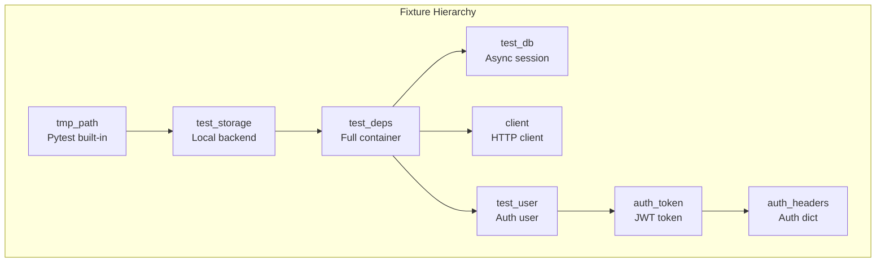

### Key Testing Patterns

1. **Test Dependency Container**: Mirrors production app.state
2. **File-based SQLite**: Allows multi-connection sharing
3. **Auto-skip Integration**: Skip if external service unavailable
4. **Fixture Composition**: Build complex states from simple fixtures

---

## DevOps & Deployment

### CI/CD Pipeline

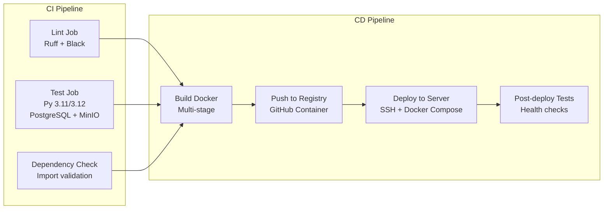

### GitHub Actions Workflows

| Workflow | Trigger | Purpose |
|----------|---------|---------|
| `ci.yml` | Push/PR | Lint, test, dependency check |
| `cd.yml` | Push to main | Build, push, deploy |
| `post-deployment-tests.yml` | After deploy | Validate production |
| `ui-tests.yml` | Push/PR | Browser testing |

### Production Architecture

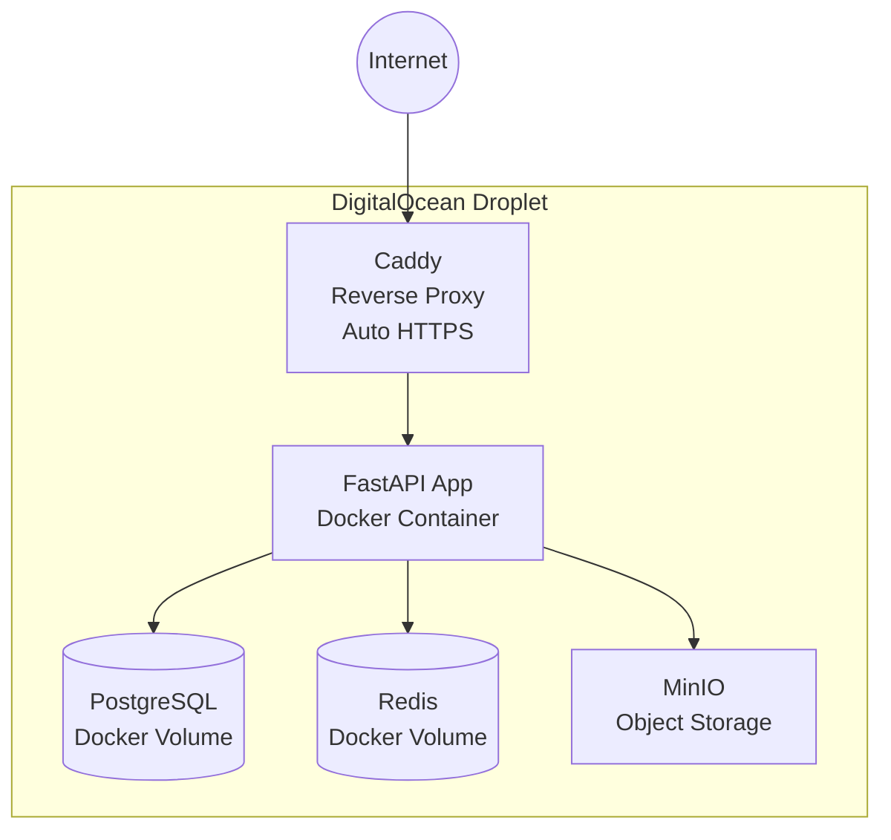

### Docker Configuration

**Multi-stage Dockerfile:**
```dockerfile
# Build stage
FROM python:3.11-slim as builder
# Install uv, copy deps, sync

# Runtime stage
FROM python:3.11-slim
# Copy from builder, non-root user
```

**Docker Compose Services:**
- `app`: FastAPI application
- `postgres`: PostgreSQL 15
- `redis`: Redis 7
- `minio`: MinIO object storage
- `caddy`: Reverse proxy with auto-HTTPS

### Backup & Recovery

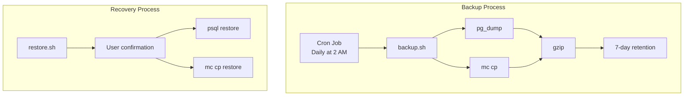

---

## Product Perspective

### User Journey

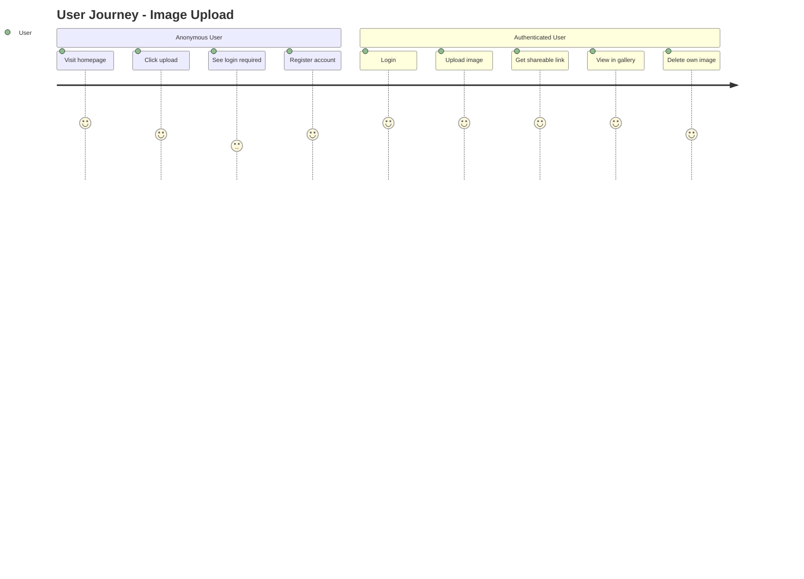

### Feature Matrix

| Feature | Phase 1 | Phase 2 | Phase 3 | Future |
|---------|---------|---------|---------|--------|
| Image Upload | Yes | Yes | Yes | Yes |
| Image Download | Yes | Yes | Yes | Yes |
| Image Metadata | Yes | Yes | Yes | Yes |
| User Auth | - | Yes | Yes | Yes |
| Thumbnails | - | Yes | Yes | Yes |
| Rate Limiting | - | Yes | Yes | Yes |
| Web UI | - | - | Yes | Yes |
| User Gallery | - | - | Yes | Yes |
| Deduplication | - | - | - | Phase 4 |
| Celery Jobs | - | - | - | Phase 4 |
| Horizontal Scale | - | - | - | Phase 5 |
| Observability | - | - | - | Phase 6 |

### User Types

```mermaid
graph TB
    subgraph "User Personas"
        ANON[Anonymous User<br/>View public images<br/>Cannot upload]
        AUTH[Authenticated User<br/>Upload images<br/>Manage gallery<br/>Delete own images]
        ADMIN[Admin<br/>Future: Content moderation]
    end
```

### Key Product Decisions

1. **Authentication Required for Upload**: Prevents abuse, enables user galleries
2. **Thumbnail Generation**: Improves gallery load time
3. **Delete Token for Legacy**: Backward compatibility with anonymous uploads
4. **HTMX for UI**: Progressive enhancement, minimal JS complexity
5. **Warm Minimal Design**: Professional aesthetic, accessibility focus

---

## Future Roadmap

### Phase 4: Advanced Features

- **Celery + Redis**: Distributed task queue
- **Multiple Thumbnail Sizes**: 150px, 300px, 600px
- **SHA-256 Checksums**: File integrity verification
- **Image Deduplication**: Hash-based duplicate detection
- **User Quotas**: Storage limits per user

### Phase 5: Horizontal Scaling

- **Load Balancer**: Nginx round-robin
- **Database Replication**: 1 primary + 2 read replicas
- **Redis Cluster**: 3 masters with Sentinel
- **CDN Integration**: CloudFront/Cloudflare
- **Storage Sharding**: Multiple S3 buckets

### Phase 6: Observability

- **Prometheus + Grafana**: Metrics and dashboards
- **Structured Logging**: Loki or ELK stack
- **Distributed Tracing**: Jaeger
- **Alerting**: PagerDuty/Slack integration
- **Circuit Breakers**: Graceful degradation

```mermaid
gantt
    title Future Development Roadmap
    dateFormat YYYY-MM

    section Phase 4
    Celery Infrastructure :p4a, 2026-02, 3w
    Multiple Thumbnails :p4b, 2026-02, 2w
    Checksum + Dedup :p4c, 2026-03, 2w
    User Quotas :p4d, 2026-03, 1w

    section Phase 5
    Load Balancer :p5a, 2026-04, 2w
    DB Replication :p5b, 2026-04, 2w
    Redis Cluster :p5c, 2026-05, 2w
    CDN + Sharding :p5d, 2026-05, 2w

    section Phase 6
    Prometheus + Grafana :p6a, 2026-06, 2w
    Logging Stack :p6b, 2026-06, 2w
    Tracing + Alerting :p6c, 2026-07, 2w
    Circuit Breakers :p6d, 2026-07, 1w
```

---

## Architecture Decision Records

### Summary of Key ADRs

| ADR | Title | Status | Impact |
|-----|-------|--------|--------|
| 0001 | Use FastAPI Framework | Accepted | Foundation |
| 0002 | PostgreSQL for Metadata | Accepted | Data layer |
| 0003 | Anonymous Access Phase 1 | Superseded | Auth model |
| 0004 | Skip Delete Token Phase 1 | Superseded | Security |
| 0005 | Structured Error Format | Accepted | API design |
| 0006 | No Kubernetes for MVP | Accepted | Deployment |
| 0007 | Use GitHub Codespaces | Accepted | Development |
| 0008 | Phase 1 Lean | Accepted | Scope |
| 0009 | Redis Caching | Accepted | Performance |
| 0010 | Concurrency Control | Accepted | Reliability |
| 0011 | JWT Authentication | Accepted | Security |
| 0012 | Background Tasks | Accepted | Processing |
| 0013 | HTMX for Web UI | Accepted | Frontend |
| 0014 | Test Dependency Container | Accepted | Testing |
| 0015 | UI Design System | Accepted | UX |

### ADR Format

Each ADR follows the template:
- **Context**: Problem background
- **Decision**: Chosen approach
- **Consequences**: Trade-offs and implications
- **Alternatives Considered**: Other options evaluated

---

## Code Quality & Standards

### Linting & Formatting

```toml
# pyproject.toml
[tool.ruff]
line-length = 100
target-version = "py311"

[tool.ruff.lint]
select = [
    "E", "W",    # pycodestyle
    "F",         # pyflakes
    "I",         # isort
    "N",         # pep8-naming
    "UP",        # pyupgrade
    "B",         # flake8-bugbear
    "C4",        # flake8-comprehensions
]
```

### Type Hints

Modern Python 3.11+ syntax throughout:
```python
# Union types
def get_image(id: str) -> Image | None: ...

# Generic types
def process(items: list[str]) -> dict[str, int]: ...

# Optional as union
def save(key: str, data: bytes | None = None) -> str: ...
```

### Pre-commit Hooks

| Hook | Purpose |
|------|---------|
| `trailing-whitespace` | Clean up whitespace |
| `end-of-file-fixer` | Ensure newline at EOF |
| `ruff` | Linting with auto-fix |
| `ruff-format` | Code formatting |
| `no-commit-to-branch` | Block direct main commits |
| `detect-private-key` | Prevent credential leaks |
| `hadolint` | Dockerfile linting |

### Commit Convention

```
<type>: <short description>

- Bullet point details
- Reference ADR if applicable

Generated with [Claude Code](https://claude.com/claude-code)

Co-Authored-By: Claude Opus 4.5 <noreply@anthropic.com>
```

Types: `feat`, `fix`, `docs`, `test`, `refactor`, `chore`

---

## Conclusion

Chitram demonstrates a well-architected, production-ready image hosting service built with modern Python best practices. Key strengths include:

1. **Clean Architecture**: Clear separation of concerns with layered services
2. **Design Patterns**: Strategy, Dependency Injection, Cache-Aside
3. **Comprehensive Testing**: 225+ tests with container-based fixtures
4. **Security Focus**: JWT auth, bcrypt, rate limiting, OWASP alignment
5. **Production Ready**: CI/CD, Docker deployment, backup/recovery
6. **Documented Decisions**: 15 ADRs capturing architectural choices
7. **Incremental Development**: 6-phase roadmap from MVP to enterprise

The codebase serves as an excellent reference for:
- FastAPI application structure
- Async database patterns with SQLAlchemy
- Redis caching and rate limiting
- Background task processing
- Test fixture design
- Production deployment with Docker

---

*This document was generated by analyzing the Chitram codebase from architecture, development, and product perspectives.*
