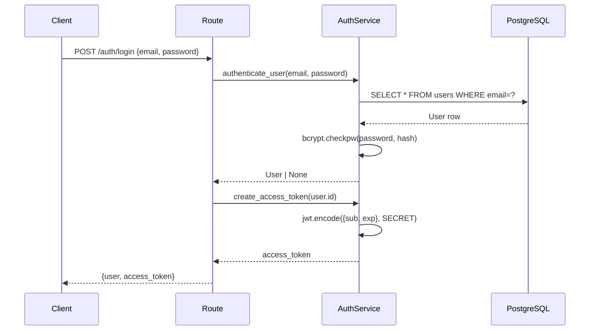
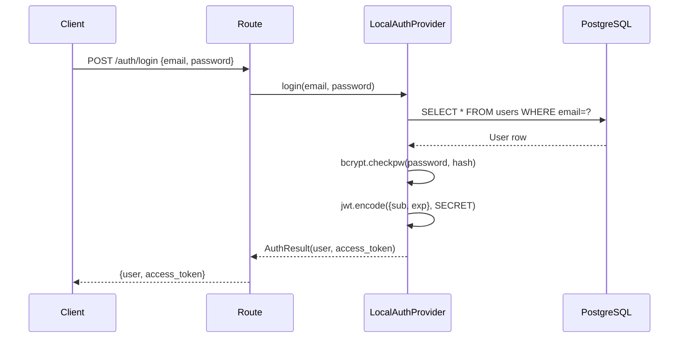
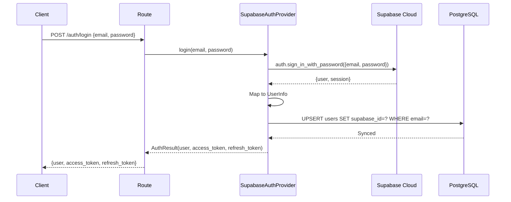
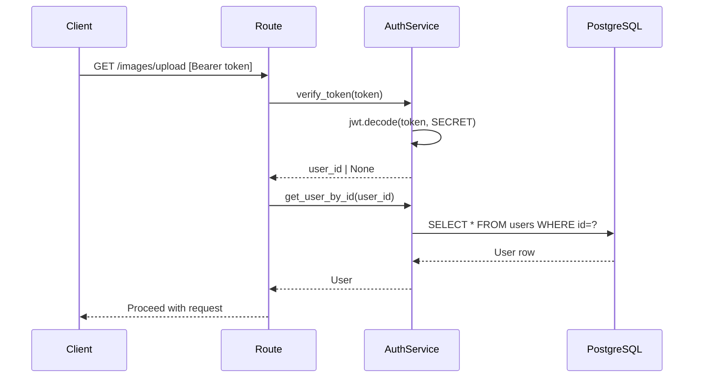
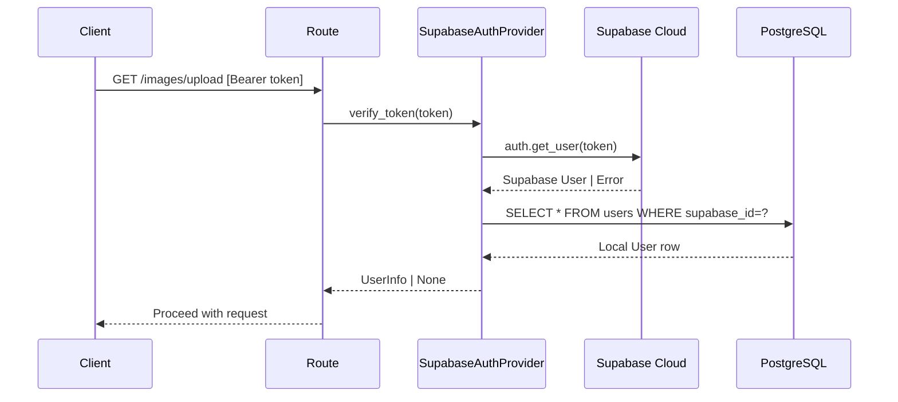
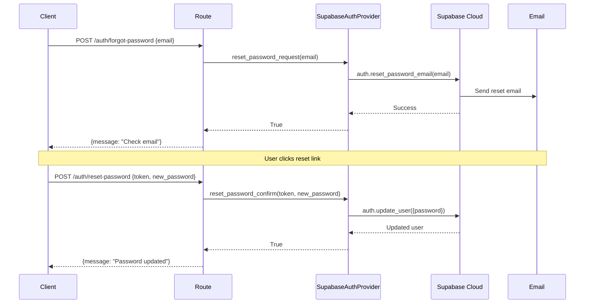

# Design Document: Pluggable Authentication System

**Feature:** Pluggable Authentication Provider Architecture
**Version:** 1.0
**Author:** Engineering Team
**Date:** 2026-01-07
**Status:** Ready for Implementation
**Related PRD:** [PRD-pluggable-auth-system.md](../requirements/PRD-pluggable-auth-system.md)

---

## Table of Contents

- [Overview](#overview)
- [Design Principles](#design-principles)
- [Current State Analysis](#current-state-analysis)
- [Target State Architecture](#target-state-architecture)
- [Data Flow Diagrams](#data-flow-diagrams)
- [Component Design](#component-design)
- [Database Changes](#database-changes)
- [API Changes](#api-changes)
- [Supabase Integration (Simplest Approach)](#supabase-integration-simplest-approach)
- [Configuration Design](#configuration-design)
- [Error Handling Strategy](#error-handling-strategy)
- [Testing Strategy](#testing-strategy)
- [Migration Plan](#migration-plan)
- [Implementation Phases](#implementation-phases)
- [File Change Summary](#file-change-summary)
- [Decision Log](#decision-log)

---

## Overview

This document provides the technical specification for implementing a pluggable authentication system in Chitram. The design prioritizes:

1. **Simplicity** - Minimal abstraction layers, straightforward code paths
2. **Maintainability** - Clear separation of concerns, easy to understand
3. **Pluggability** - Swap providers via configuration without code changes
4. **Decoupling** - Auth logic isolated from business logic
5. **Testability** - Every component independently testable

### Scope

| In Scope | Out of Scope |
|----------|--------------|
| Provider abstraction interface | Enterprise SSO (SAML) |
| LocalAuthProvider (existing logic) | Custom OAuth providers |
| SupabaseAuthProvider | Phone/SMS authentication |
| Email/password authentication | MFA (Phase 2) |
| Password reset flow | Email templates customization |
| Token refresh mechanism | Admin user management UI |

---

## Design Principles

### 1. KISS - Keep It Simple, Stupid

```
BAD: Multiple abstraction layers
┌─────────┐   ┌─────────────┐   ┌──────────┐   ┌──────────┐
│ Route   │ → │ AuthManager │ → │ Provider │ → │ Adapter  │ → Supabase
└─────────┘   └─────────────┘   └──────────┘   └──────────┘

GOOD: Direct provider access
┌─────────┐   ┌──────────┐
│ Route   │ → │ Provider │ → Supabase
└─────────┘   └──────────┘
```

### 2. Dependency Inversion Principle (DIP)

High-level modules (API routes) depend on abstractions (AuthProvider interface), not concrete implementations (SupabaseAuthProvider).

```python
# Routes depend on interface, not implementation
def get_current_user(
    provider: AuthProvider = Depends(get_auth_provider)
) -> User | None:
    ...
```

### 3. Strategy Pattern

Same pattern as existing `StorageService` - proven in this codebase.

```python
# Existing pattern (storage)
class StorageBackend(ABC): ...
class LocalStorageBackend(StorageBackend): ...
class MinioStorageBackend(StorageBackend): ...

# New pattern (auth) - mirrors existing
class AuthProvider(ABC): ...
class LocalAuthProvider(AuthProvider): ...
class SupabaseAuthProvider(AuthProvider): ...
```

### 4. Fail Fast, Fail Loud

Configuration errors detected at startup, not at runtime.

```python
@asynccontextmanager
async def lifespan(app: FastAPI):
    # Fail immediately if auth config invalid
    app.state.auth_provider = create_auth_provider(settings)
    yield
```

---

## Current State Analysis

### Current Architecture

```
┌─────────────────────────────────────────────────────────────────────┐
│                         CURRENT STATE                                │
└─────────────────────────────────────────────────────────────────────┘

┌──────────────────┐     ┌──────────────────┐     ┌──────────────────┐
│   API Routes     │     │   Web Routes     │     │  Images Routes   │
│  (api/auth.py)   │     │  (api/web.py)    │     │ (api/images.py)  │
└────────┬─────────┘     └────────┬─────────┘     └────────┬─────────┘
         │                        │                        │
         │ Depends()              │ Direct                 │ Depends()
         ▼                        ▼                        ▼
┌─────────────────────────────────────────────────────────────────────┐
│                        AuthService                                   │
│  ┌─────────────┐  ┌─────────────┐  ┌─────────────┐  ┌────────────┐ │
│  │ hash_pwd()  │  │ verify_pwd()│  │create_token()│  │verify_tkn()│ │
│  └─────────────┘  └─────────────┘  └─────────────┘  └────────────┘ │
│  ┌─────────────┐  ┌─────────────┐  ┌─────────────┐                 │
│  │get_by_email()│ │get_by_id() │  │create_user()│                 │
│  └─────────────┘  └─────────────┘  └─────────────┘                 │
└─────────────────────────────────────────────────────────────────────┘
         │
         ▼
┌─────────────────────────────────────────────────────────────────────┐
│                      PostgreSQL (users table)                        │
│  ┌─────────────────────────────────────────────────────────────┐   │
│  │ id | email | password_hash | is_active | created_at         │   │
│  └─────────────────────────────────────────────────────────────┘   │
└─────────────────────────────────────────────────────────────────────┘
```

### Current File Structure

```
backend/app/
├── services/
│   └── auth_service.py      # 125 lines - ALL auth logic here
├── api/
│   ├── auth.py              # 132 lines - API routes + dependencies
│   └── web.py               # 230 lines - Cookie auth + web pages
├── models/
│   └── user.py              # 38 lines - SQLAlchemy model
└── schemas/
    └── auth.py              # 46 lines - Pydantic schemas
```

### Current Data Flow: Login

```
1. POST /api/v1/auth/login
   │
2. │ UserLogin schema validates email/password
   │
3. ▼ get_auth_service() creates AuthService(db)
   │
4. │ auth_service.authenticate_user(email, password)
   │  ├── SELECT * FROM users WHERE email = ?
   │  ├── bcrypt.checkpw(password, password_hash)
   │  └── Return User or None
   │
5. │ auth_service.create_access_token(user.id)
   │  └── jwt.encode({sub: user_id, exp: now+24h}, SECRET)
   │
6. ▼ Return AuthResponse(user, access_token)
```

### Current Data Flow: Protected Route

```
1. GET /api/v1/images/upload (with Authorization: Bearer <token>)
   │
2. │ oauth2_scheme extracts token from header
   │
3. ▼ get_current_user(token, auth_service)
   │  ├── auth_service.verify_token(token)
   │  │   └── jwt.decode(token, SECRET) → user_id
   │  └── auth_service.get_user_by_id(user_id)
   │      └── SELECT * FROM users WHERE id = ?
   │
4. │ require_current_user(user)
   │  └── Raise 401 if user is None
   │
5. ▼ Proceed with upload
```

### Current Pain Points

| Issue | Impact | Lines of Code |
|-------|--------|---------------|
| No password reset | Users locked out forever | 0 (missing) |
| No token refresh | 24h max session | 0 (missing) |
| No token revocation | Can't logout securely | 0 (missing) |
| Tight coupling | Can't swap auth providers | 125 (auth_service.py) |
| bcrypt in app code | Security maintenance burden | 15 lines |
| JWT signing in app | Key rotation complexity | 20 lines |

---

## Target State Architecture

### Target Architecture

```
┌─────────────────────────────────────────────────────────────────────┐
│                         TARGET STATE                                 │
└─────────────────────────────────────────────────────────────────────┘

┌──────────────────┐     ┌──────────────────┐     ┌──────────────────┐
│   API Routes     │     │   Web Routes     │     │  Images Routes   │
│  (api/auth.py)   │     │  (api/web.py)    │     │ (api/images.py)  │
└────────┬─────────┘     └────────┬─────────┘     └────────┬─────────┘
         │                        │                        │
         │ Depends()              │ Depends()              │ Depends()
         ▼                        ▼                        ▼
┌─────────────────────────────────────────────────────────────────────┐
│                     AuthProvider (Interface)                         │
│  ┌─────────────────────────────────────────────────────────────┐   │
│  │ + register(email, password) → AuthResult                     │   │
│  │ + login(email, password) → AuthResult                        │   │
│  │ + verify_token(token) → UserInfo | None                      │   │
│  │ + refresh_token(refresh_token) → AuthResult                  │   │
│  │ + logout(token) → bool                                       │   │
│  │ + get_user(user_id) → UserInfo | None                        │   │
│  │ + reset_password_request(email) → bool                       │   │
│  │ + reset_password_confirm(token, new_password) → bool         │   │
│  └─────────────────────────────────────────────────────────────┘   │
└─────────────────────────────────────────────────────────────────────┘
         │                                    │
         │ AUTH_PROVIDER=local                │ AUTH_PROVIDER=supabase
         ▼                                    ▼
┌─────────────────────────┐      ┌─────────────────────────────────┐
│   LocalAuthProvider     │      │   SupabaseAuthProvider          │
├─────────────────────────┤      ├─────────────────────────────────┤
│ - bcrypt password hash  │      │ - supabase-py SDK               │
│ - JWT token generation  │      │ - Supabase GoTrue API           │
│ - Local PostgreSQL      │      │ - Managed user storage          │
│ - Same as current impl  │      │ - OAuth, MFA built-in           │
└───────────┬─────────────┘      └───────────────┬─────────────────┘
            │                                    │
            ▼                                    ▼
┌─────────────────────────┐      ┌─────────────────────────────────┐
│   PostgreSQL (local)    │      │   Supabase Cloud                │
│   users table           │      │   auth.users + sync to local    │
└─────────────────────────┘      └─────────────────────────────────┘
```

### Target File Structure

```
backend/app/
├── services/
│   ├── auth/                         # NEW: Auth module
│   │   ├── __init__.py               # Exports: AuthProvider, get_auth_provider
│   │   ├── base.py                   # AuthProvider ABC + dataclasses
│   │   ├── local_provider.py         # LocalAuthProvider (refactored)
│   │   ├── supabase_provider.py      # SupabaseAuthProvider (new)
│   │   └── factory.py                # Provider factory function
│   └── auth_service.py               # DEPRECATED → imports from auth/
├── api/
│   ├── auth.py                       # MODIFIED: Use AuthProvider
│   └── web.py                        # MODIFIED: Use AuthProvider
├── models/
│   └── user.py                       # MODIFIED: Add supabase_id
└── schemas/
    └── auth.py                       # EXTENDED: Add refresh_token, etc.
```

---

## Data Flow Diagrams

### Before: Login Flow



### After: Login Flow (Local Provider)



### After: Login Flow (Supabase Provider)



### Before: Token Verification



### After: Token Verification (Supabase Provider)



### Password Reset Flow (Supabase Only)



---

## Component Design

### Core Interface: AuthProvider

```python
# backend/app/services/auth/base.py

from abc import ABC, abstractmethod
from dataclasses import dataclass, field
from datetime import datetime
from enum import Enum


class AuthProviderType(str, Enum):
    """Supported auth provider types."""
    LOCAL = "local"
    SUPABASE = "supabase"


@dataclass
class UserInfo:
    """
    Provider-agnostic user representation.

    This is the contract between auth providers and the application.
    All providers must return data in this format.
    """
    id: str                      # Internal user ID (UUID)
    email: str
    is_active: bool = True
    created_at: datetime | None = None
    email_verified: bool = False

    # Provider-specific ID (e.g., Supabase user ID)
    provider_id: str | None = None


@dataclass
class AuthResult:
    """
    Authentication result returned by login/register.

    Standardized across all providers.
    """
    user: UserInfo
    access_token: str
    refresh_token: str | None = None
    token_type: str = "bearer"
    expires_in: int = 3600  # seconds


@dataclass
class AuthError:
    """Standardized auth error for consistent handling."""
    code: str
    message: str
    details: dict = field(default_factory=dict)


class AuthProvider(ABC):
    """
    Abstract base class for authentication providers.

    Design notes:
    - All methods are async for consistency (even if some are sync internally)
    - Methods return None or raise AuthError, never raise generic exceptions
    - UserInfo is the universal contract - providers map their data to this

    Implementations:
    - LocalAuthProvider: Current bcrypt/JWT logic
    - SupabaseAuthProvider: Supabase SDK wrapper
    """

    @property
    @abstractmethod
    def provider_type(self) -> AuthProviderType:
        """Return the provider type identifier."""
        pass

    # =========================================================================
    # Core Auth Methods (Required)
    # =========================================================================

    @abstractmethod
    async def register(
        self,
        email: str,
        password: str,
        metadata: dict | None = None,
    ) -> AuthResult:
        """
        Register a new user.

        Args:
            email: User's email address
            password: Plain text password (min 8 chars)
            metadata: Optional user metadata

        Returns:
            AuthResult with user info and tokens

        Raises:
            AuthError: If registration fails (email exists, etc.)
        """
        pass

    @abstractmethod
    async def login(
        self,
        email: str,
        password: str,
    ) -> AuthResult:
        """
        Authenticate user with credentials.

        Args:
            email: User's email address
            password: Plain text password

        Returns:
            AuthResult with user info and tokens

        Raises:
            AuthError: If authentication fails
        """
        pass

    @abstractmethod
    async def verify_token(self, token: str) -> UserInfo | None:
        """
        Verify access token and return user info.

        Args:
            token: JWT access token

        Returns:
            UserInfo if token valid, None otherwise
        """
        pass

    @abstractmethod
    async def get_user(self, user_id: str) -> UserInfo | None:
        """
        Get user by internal ID.

        Args:
            user_id: Internal user ID (not provider ID)

        Returns:
            UserInfo if found, None otherwise
        """
        pass

    @abstractmethod
    async def logout(self, token: str) -> bool:
        """
        Invalidate user session/token.

        Args:
            token: Access token to invalidate

        Returns:
            True if logout successful
        """
        pass

    # =========================================================================
    # Extended Auth Methods (Optional - Override if supported)
    # =========================================================================

    async def refresh_token(self, refresh_token: str) -> AuthResult:
        """
        Refresh access token using refresh token.

        Default: Not supported (raises NotImplementedError)
        """
        raise NotImplementedError(
            f"{self.provider_type} does not support token refresh"
        )

    async def reset_password_request(self, email: str) -> bool:
        """
        Request password reset email.

        Default: Not supported
        """
        raise NotImplementedError(
            f"{self.provider_type} does not support password reset"
        )

    async def reset_password_confirm(
        self,
        token: str,
        new_password: str,
    ) -> bool:
        """
        Confirm password reset with token.

        Default: Not supported
        """
        raise NotImplementedError(
            f"{self.provider_type} does not support password reset"
        )
```

### LocalAuthProvider Implementation

```python
# backend/app/services/auth/local_provider.py

"""
Local authentication provider using bcrypt and JWT.

This is a refactored version of the existing AuthService,
implementing the AuthProvider interface.
"""

import hashlib
import secrets
from datetime import UTC, datetime, timedelta

import bcrypt as bcrypt_lib
from jose import JWTError, jwt
from sqlalchemy import select
from sqlalchemy.ext.asyncio import AsyncSession, async_sessionmaker

from app.models.user import User

from .base import AuthError, AuthProvider, AuthProviderType, AuthResult, UserInfo

# bcrypt work factor 12 (~200-400ms to hash)
BCRYPT_WORK_FACTOR = 12


class LocalAuthProvider(AuthProvider):
    """
    Local authentication using bcrypt password hashing and JWT tokens.

    This provider stores users in the local PostgreSQL database and
    handles all authentication logic locally.

    Configuration:
        - jwt_secret_key: Secret for signing JWTs
        - jwt_algorithm: JWT algorithm (default: HS256)
        - jwt_expire_minutes: Token expiry (default: 1440 = 24 hours)
    """

    def __init__(
        self,
        session_factory: async_sessionmaker[AsyncSession],
        jwt_secret_key: str,
        jwt_algorithm: str = "HS256",
        jwt_expire_minutes: int = 1440,
    ):
        self._session_factory = session_factory
        self._jwt_secret_key = jwt_secret_key
        self._jwt_algorithm = jwt_algorithm
        self._jwt_expire_minutes = jwt_expire_minutes

    @property
    def provider_type(self) -> AuthProviderType:
        return AuthProviderType.LOCAL

    # =========================================================================
    # AuthProvider Interface Implementation
    # =========================================================================

    async def register(
        self,
        email: str,
        password: str,
        metadata: dict | None = None,
    ) -> AuthResult:
        async with self._session_factory() as session:
            # Check for existing user
            existing = await self._get_user_by_email(session, email)
            if existing:
                raise AuthError(
                    code="EMAIL_EXISTS",
                    message="Email already registered",
                )

            # Create user
            password_hash = self._hash_password(password)
            user = User(email=email, password_hash=password_hash)
            session.add(user)
            await session.commit()
            await session.refresh(user)

            # Generate token
            access_token = self._create_access_token(user.id)

            return AuthResult(
                user=self._to_user_info(user),
                access_token=access_token,
                refresh_token=None,  # Local provider doesn't support refresh
                expires_in=self._jwt_expire_minutes * 60,
            )

    async def login(self, email: str, password: str) -> AuthResult:
        async with self._session_factory() as session:
            user = await self._get_user_by_email(session, email)

            if user is None:
                # Run hash anyway to prevent timing attacks
                self._hash_password(password)
                raise AuthError(
                    code="INVALID_CREDENTIALS",
                    message="Invalid email or password",
                )

            if not self._verify_password(password, user.password_hash):
                raise AuthError(
                    code="INVALID_CREDENTIALS",
                    message="Invalid email or password",
                )

            if not user.is_active:
                raise AuthError(
                    code="USER_INACTIVE",
                    message="User account is inactive",
                )

            access_token = self._create_access_token(user.id)

            return AuthResult(
                user=self._to_user_info(user),
                access_token=access_token,
                refresh_token=None,
                expires_in=self._jwt_expire_minutes * 60,
            )

    async def verify_token(self, token: str) -> UserInfo | None:
        user_id = self._decode_token(token)
        if user_id is None:
            return None

        async with self._session_factory() as session:
            user = await self._get_user_by_id(session, user_id)
            if user is None or not user.is_active:
                return None
            return self._to_user_info(user)

    async def get_user(self, user_id: str) -> UserInfo | None:
        async with self._session_factory() as session:
            user = await self._get_user_by_id(session, user_id)
            if user is None:
                return None
            return self._to_user_info(user)

    async def logout(self, token: str) -> bool:
        # Local provider doesn't support token revocation
        # Token remains valid until expiry
        return True

    # =========================================================================
    # Delete Token Methods (Preserved from AuthService)
    # =========================================================================

    @staticmethod
    def generate_delete_token() -> str:
        """Generate a secure 32-byte URL-safe delete token."""
        return secrets.token_urlsafe(32)

    @staticmethod
    def hash_delete_token(token: str) -> str:
        """Hash delete token using SHA-256 for storage."""
        return hashlib.sha256(token.encode()).hexdigest()

    @staticmethod
    def verify_delete_token(token: str, token_hash: str) -> bool:
        """Verify delete token against stored hash (timing-safe)."""
        computed_hash = hashlib.sha256(token.encode()).hexdigest()
        return secrets.compare_digest(computed_hash, token_hash)

    # =========================================================================
    # Private Helper Methods
    # =========================================================================

    def _hash_password(self, password: str) -> str:
        salt = bcrypt_lib.gensalt(rounds=BCRYPT_WORK_FACTOR)
        return bcrypt_lib.hashpw(password.encode(), salt).decode()

    def _verify_password(self, plain: str, hashed: str) -> bool:
        try:
            return bcrypt_lib.checkpw(plain.encode(), hashed.encode())
        except Exception:
            return False

    def _create_access_token(self, user_id: str) -> str:
        expire = datetime.now(UTC) + timedelta(minutes=self._jwt_expire_minutes)
        payload = {
            "sub": user_id,
            "exp": expire,
            "iat": datetime.now(UTC),
        }
        return jwt.encode(payload, self._jwt_secret_key, algorithm=self._jwt_algorithm)

    def _decode_token(self, token: str) -> str | None:
        try:
            payload = jwt.decode(
                token,
                self._jwt_secret_key,
                algorithms=[self._jwt_algorithm],
            )
            return payload.get("sub")
        except JWTError:
            return None

    async def _get_user_by_email(
        self,
        session: AsyncSession,
        email: str,
    ) -> User | None:
        result = await session.execute(select(User).where(User.email == email))
        return result.scalar_one_or_none()

    async def _get_user_by_id(
        self,
        session: AsyncSession,
        user_id: str,
    ) -> User | None:
        result = await session.execute(select(User).where(User.id == user_id))
        return result.scalar_one_or_none()

    def _to_user_info(self, user: User) -> UserInfo:
        return UserInfo(
            id=user.id,
            email=user.email,
            is_active=user.is_active,
            created_at=user.created_at,
            email_verified=True,  # Local assumes verified
            provider_id=None,
        )
```

### SupabaseAuthProvider Implementation

```python
# backend/app/services/auth/supabase_provider.py

"""
Supabase authentication provider.

Uses the simplest integration approach:
1. supabase-py SDK for auth operations
2. Sync Supabase users to local database on login/register
3. Local user table as source of truth for image ownership

References:
- https://supabase.com/docs/reference/python/introduction
- https://github.com/supabase/supabase-py
"""

from datetime import UTC, datetime

from sqlalchemy import select
from sqlalchemy.ext.asyncio import AsyncSession, async_sessionmaker
from supabase import Client, create_client
from supabase.lib.client_options import ClientOptions

from app.models.user import User

from .base import AuthError, AuthProvider, AuthProviderType, AuthResult, UserInfo


class SupabaseAuthProvider(AuthProvider):
    """
    Supabase authentication provider.

    Simplest integration approach:
    - Uses supabase-py SDK for all auth operations
    - Syncs Supabase user to local DB on first interaction
    - Local user.id used for image ownership (FK constraint)
    - Supabase user ID stored in user.supabase_id for reference

    Configuration:
        - supabase_url: Project URL (https://xxx.supabase.co)
        - supabase_anon_key: Public anon key (for client-side safe ops)
        - supabase_service_key: Service role key (for admin ops)
    """

    def __init__(
        self,
        session_factory: async_sessionmaker[AsyncSession],
        supabase_url: str,
        supabase_anon_key: str,
        supabase_service_key: str | None = None,
    ):
        self._session_factory = session_factory
        self._supabase_url = supabase_url

        # Client for normal auth operations (uses anon key)
        self._client: Client = create_client(
            supabase_url,
            supabase_anon_key,
            options=ClientOptions(
                auto_refresh_token=False,  # We handle refresh explicitly
                persist_session=False,     # Stateless API server
            ),
        )

        # Admin client for user management (uses service key)
        if supabase_service_key:
            self._admin_client: Client | None = create_client(
                supabase_url,
                supabase_service_key,
            )
        else:
            self._admin_client = None

    @property
    def provider_type(self) -> AuthProviderType:
        return AuthProviderType.SUPABASE

    # =========================================================================
    # AuthProvider Interface Implementation
    # =========================================================================

    async def register(
        self,
        email: str,
        password: str,
        metadata: dict | None = None,
    ) -> AuthResult:
        try:
            # Register with Supabase
            response = self._client.auth.sign_up({
                "email": email,
                "password": password,
                "options": {"data": metadata or {}},
            })

            if response.user is None:
                raise AuthError(
                    code="REGISTRATION_FAILED",
                    message="Failed to create user account",
                )

            # Sync to local database
            user_info = await self._sync_user(response.user)

            # Get tokens
            access_token = response.session.access_token if response.session else ""
            refresh_token = response.session.refresh_token if response.session else None

            return AuthResult(
                user=user_info,
                access_token=access_token,
                refresh_token=refresh_token,
                expires_in=3600,  # Supabase default
            )

        except Exception as e:
            error_msg = str(e).lower()
            if "already registered" in error_msg or "duplicate" in error_msg:
                raise AuthError(code="EMAIL_EXISTS", message="Email already registered")
            raise AuthError(code="REGISTRATION_FAILED", message=str(e))

    async def login(self, email: str, password: str) -> AuthResult:
        try:
            response = self._client.auth.sign_in_with_password({
                "email": email,
                "password": password,
            })

            if response.user is None or response.session is None:
                raise AuthError(
                    code="INVALID_CREDENTIALS",
                    message="Invalid email or password",
                )

            # Sync to local database
            user_info = await self._sync_user(response.user)

            return AuthResult(
                user=user_info,
                access_token=response.session.access_token,
                refresh_token=response.session.refresh_token,
                expires_in=response.session.expires_in or 3600,
            )

        except AuthError:
            raise
        except Exception as e:
            raise AuthError(code="INVALID_CREDENTIALS", message="Invalid email or password")

    async def verify_token(self, token: str) -> UserInfo | None:
        try:
            # Validate token with Supabase
            response = self._client.auth.get_user(token)

            if response.user is None:
                return None

            # Get local user by Supabase ID
            async with self._session_factory() as session:
                result = await session.execute(
                    select(User).where(User.supabase_id == response.user.id)
                )
                user = result.scalar_one_or_none()

                if user is None:
                    # User exists in Supabase but not synced - sync now
                    user_info = await self._sync_user(response.user)
                    return user_info

                if not user.is_active:
                    return None

                return self._to_user_info(user, response.user.id)

        except Exception:
            return None

    async def get_user(self, user_id: str) -> UserInfo | None:
        async with self._session_factory() as session:
            result = await session.execute(
                select(User).where(User.id == user_id)
            )
            user = result.scalar_one_or_none()

            if user is None or not user.is_active:
                return None

            return self._to_user_info(user, user.supabase_id)

    async def logout(self, token: str) -> bool:
        try:
            self._client.auth.sign_out()
            return True
        except Exception:
            return False

    async def refresh_token(self, refresh_token: str) -> AuthResult:
        try:
            response = self._client.auth.refresh_session(refresh_token)

            if response.user is None or response.session is None:
                raise AuthError(
                    code="REFRESH_FAILED",
                    message="Failed to refresh token",
                )

            user_info = await self._sync_user(response.user)

            return AuthResult(
                user=user_info,
                access_token=response.session.access_token,
                refresh_token=response.session.refresh_token,
                expires_in=response.session.expires_in or 3600,
            )

        except AuthError:
            raise
        except Exception as e:
            raise AuthError(code="REFRESH_FAILED", message=str(e))

    async def reset_password_request(self, email: str) -> bool:
        try:
            self._client.auth.reset_password_email(email)
            return True
        except Exception:
            # Don't reveal if email exists
            return True

    async def reset_password_confirm(
        self,
        token: str,
        new_password: str,
    ) -> bool:
        try:
            self._client.auth.update_user({"password": new_password})
            return True
        except Exception as e:
            raise AuthError(code="RESET_FAILED", message=str(e))

    # =========================================================================
    # User Synchronization
    # =========================================================================

    async def _sync_user(self, supabase_user) -> UserInfo:
        """
        Sync Supabase user to local database.

        Strategy:
        1. Look up by supabase_id first
        2. If not found, look up by email (migration case)
        3. If not found, create new local user

        Returns UserInfo with local user.id (for FK relationships)
        """
        async with self._session_factory() as session:
            # Try to find by Supabase ID
            result = await session.execute(
                select(User).where(User.supabase_id == supabase_user.id)
            )
            user = result.scalar_one_or_none()

            if user is None:
                # Try to find by email (migration case)
                result = await session.execute(
                    select(User).where(User.email == supabase_user.email)
                )
                user = result.scalar_one_or_none()

                if user:
                    # Link existing user to Supabase
                    user.supabase_id = supabase_user.id
                    await session.commit()

            if user is None:
                # Create new local user
                user = User(
                    email=supabase_user.email,
                    password_hash="SUPABASE_MANAGED",  # Placeholder
                    supabase_id=supabase_user.id,
                )
                session.add(user)
                await session.commit()
                await session.refresh(user)

            return self._to_user_info(user, supabase_user.id)

    def _to_user_info(self, user: User, supabase_id: str | None = None) -> UserInfo:
        return UserInfo(
            id=user.id,  # Local user ID (for FK)
            email=user.email,
            is_active=user.is_active,
            created_at=user.created_at,
            email_verified=True,  # Supabase manages verification
            provider_id=supabase_id,
        )
```

### Provider Factory

```python
# backend/app/services/auth/factory.py

"""
Auth provider factory - creates provider based on configuration.
"""

from sqlalchemy.ext.asyncio import async_sessionmaker, AsyncSession

from app.config import Settings

from .base import AuthProvider, AuthProviderType
from .local_provider import LocalAuthProvider
from .supabase_provider import SupabaseAuthProvider


def create_auth_provider(
    settings: Settings,
    session_factory: async_sessionmaker[AsyncSession],
) -> AuthProvider:
    """
    Factory function to create auth provider based on configuration.

    Args:
        settings: Application settings
        session_factory: Database session factory

    Returns:
        Configured AuthProvider instance

    Raises:
        ValueError: If provider type unknown or config invalid
    """
    provider_type = AuthProviderType(settings.auth_provider)

    if provider_type == AuthProviderType.SUPABASE:
        # Validate Supabase config
        if not settings.supabase_url:
            raise ValueError("SUPABASE_URL required when AUTH_PROVIDER=supabase")
        if not settings.supabase_anon_key:
            raise ValueError("SUPABASE_ANON_KEY required when AUTH_PROVIDER=supabase")

        return SupabaseAuthProvider(
            session_factory=session_factory,
            supabase_url=settings.supabase_url,
            supabase_anon_key=settings.supabase_anon_key,
            supabase_service_key=settings.supabase_service_key,
        )

    elif provider_type == AuthProviderType.LOCAL:
        return LocalAuthProvider(
            session_factory=session_factory,
            jwt_secret_key=settings.jwt_secret_key,
            jwt_algorithm=settings.jwt_algorithm,
            jwt_expire_minutes=settings.jwt_expire_minutes,
        )

    else:
        raise ValueError(f"Unknown auth provider: {provider_type}")
```

---

## Database Changes

### Migration: Add supabase_id Column

```python
# alembic/versions/xxx_add_supabase_id.py

"""Add supabase_id column to users table.

Revision ID: xxx
Create Date: 2026-01-XX
"""

from alembic import op
import sqlalchemy as sa


def upgrade() -> None:
    # Add supabase_id column (nullable for existing users)
    op.add_column(
        'users',
        sa.Column('supabase_id', sa.String(36), nullable=True, unique=True)
    )

    # Add auth_provider column to track which provider created the user
    op.add_column(
        'users',
        sa.Column('auth_provider', sa.String(20), nullable=False, server_default='local')
    )

    # Index for Supabase ID lookups
    op.create_index('ix_users_supabase_id', 'users', ['supabase_id'])


def downgrade() -> None:
    op.drop_index('ix_users_supabase_id')
    op.drop_column('users', 'auth_provider')
    op.drop_column('users', 'supabase_id')
```

### Updated User Model

```python
# backend/app/models/user.py

class User(Base):
    """User model for authentication."""

    __tablename__ = "users"

    id: Mapped[str] = mapped_column(
        String(36),
        primary_key=True,
        default=generate_uuid,
    )
    email: Mapped[str] = mapped_column(
        String(255), unique=True, nullable=False, index=True
    )
    password_hash: Mapped[str] = mapped_column(String(255), nullable=False)
    is_active: Mapped[bool] = mapped_column(Boolean, default=True, nullable=False)
    created_at: Mapped[datetime] = mapped_column(
        DateTime(timezone=True),
        default=utc_now,
        nullable=False,
    )

    # NEW: Supabase integration
    supabase_id: Mapped[str | None] = mapped_column(
        String(36), unique=True, nullable=True, index=True
    )
    auth_provider: Mapped[str] = mapped_column(
        String(20), nullable=False, default="local"
    )
```

---

## API Changes

### Updated Dependencies

```python
# backend/app/api/auth.py

from app.services.auth import AuthProvider, get_auth_provider
from app.services.auth.base import AuthError, UserInfo

router = APIRouter(prefix="/api/v1/auth", tags=["auth"])

oauth2_scheme = OAuth2PasswordBearer(tokenUrl="/api/v1/auth/token", auto_error=False)


def get_provider(request: Request) -> AuthProvider:
    """Get auth provider from app state."""
    return request.app.state.auth_provider


async def get_current_user(
    token: str | None = Depends(oauth2_scheme),
    provider: AuthProvider = Depends(get_provider),
) -> UserInfo | None:
    """Get current user from JWT token. Returns None if not authenticated."""
    if token is None:
        return None
    return await provider.verify_token(token)


async def require_current_user(
    user: UserInfo | None = Depends(get_current_user),
) -> UserInfo:
    """Require authenticated user. Raises 401 if not authenticated."""
    if user is None:
        raise HTTPException(
            status_code=status.HTTP_401_UNAUTHORIZED,
            detail=ErrorDetail(
                code="UNAUTHORIZED",
                message="Not authenticated",
            ).model_dump(),
            headers={"WWW-Authenticate": "Bearer"},
        )
    return user
```

### Updated Endpoints

```python
# backend/app/api/auth.py (continued)

@router.post("/register", response_model=AuthResponse, status_code=status.HTTP_201_CREATED)
async def register(
    data: UserRegister,
    provider: AuthProvider = Depends(get_provider),
) -> AuthResponse:
    """Register a new user account."""
    try:
        result = await provider.register(data.email, data.password)
        return AuthResponse(
            user=UserResponse(
                id=result.user.id,
                email=result.user.email,
                is_active=result.user.is_active,
                created_at=result.user.created_at,
            ),
            access_token=result.access_token,
            refresh_token=result.refresh_token,
            expires_in=result.expires_in,
        )
    except AuthError as e:
        raise HTTPException(
            status_code=_error_status(e.code),
            detail=ErrorDetail(code=e.code, message=e.message).model_dump(),
        )


@router.post("/login", response_model=AuthResponse)
async def login(
    data: UserLogin,
    provider: AuthProvider = Depends(get_provider),
) -> AuthResponse:
    """Login with email and password."""
    try:
        result = await provider.login(data.email, data.password)
        return AuthResponse(
            user=UserResponse(
                id=result.user.id,
                email=result.user.email,
                is_active=result.user.is_active,
                created_at=result.user.created_at,
            ),
            access_token=result.access_token,
            refresh_token=result.refresh_token,
            expires_in=result.expires_in,
        )
    except AuthError as e:
        raise HTTPException(
            status_code=_error_status(e.code),
            detail=ErrorDetail(code=e.code, message=e.message).model_dump(),
        )


# NEW: Refresh token endpoint
@router.post("/refresh", response_model=AuthResponse)
async def refresh(
    data: RefreshTokenRequest,
    provider: AuthProvider = Depends(get_provider),
) -> AuthResponse:
    """Refresh access token using refresh token."""
    try:
        result = await provider.refresh_token(data.refresh_token)
        return AuthResponse(
            user=UserResponse(
                id=result.user.id,
                email=result.user.email,
                is_active=result.user.is_active,
                created_at=result.user.created_at,
            ),
            access_token=result.access_token,
            refresh_token=result.refresh_token,
            expires_in=result.expires_in,
        )
    except AuthError as e:
        raise HTTPException(
            status_code=_error_status(e.code),
            detail=ErrorDetail(code=e.code, message=e.message).model_dump(),
        )
    except NotImplementedError:
        raise HTTPException(
            status_code=status.HTTP_501_NOT_IMPLEMENTED,
            detail=ErrorDetail(
                code="NOT_SUPPORTED",
                message="Token refresh not supported by current provider",
            ).model_dump(),
        )


# NEW: Password reset request
@router.post("/forgot-password", status_code=status.HTTP_202_ACCEPTED)
async def forgot_password(
    data: ForgotPasswordRequest,
    provider: AuthProvider = Depends(get_provider),
):
    """Request password reset email."""
    try:
        await provider.reset_password_request(data.email)
        # Always return success to prevent email enumeration
        return {"message": "If the email exists, a reset link will be sent"}
    except NotImplementedError:
        raise HTTPException(
            status_code=status.HTTP_501_NOT_IMPLEMENTED,
            detail=ErrorDetail(
                code="NOT_SUPPORTED",
                message="Password reset not supported by current provider",
            ).model_dump(),
        )


def _error_status(code: str) -> int:
    """Map error code to HTTP status."""
    return {
        "EMAIL_EXISTS": 400,
        "INVALID_CREDENTIALS": 401,
        "USER_INACTIVE": 403,
        "REFRESH_FAILED": 401,
    }.get(code, 500)
```

### Updated Schemas

```python
# backend/app/schemas/auth.py

class AuthResponse(BaseModel):
    """Combined auth response with user and token."""
    user: UserResponse
    access_token: str
    refresh_token: str | None = None  # NEW
    token_type: str = "bearer"
    expires_in: int = 3600  # NEW


class RefreshTokenRequest(BaseModel):
    """Request to refresh access token."""
    refresh_token: str


class ForgotPasswordRequest(BaseModel):
    """Request password reset."""
    email: EmailStr


class ResetPasswordRequest(BaseModel):
    """Confirm password reset."""
    token: str
    new_password: str = Field(..., min_length=8, max_length=128)
```

---

## Supabase Integration (Simplest Approach)

### Why This Approach is Simplest

| Approach | Complexity | Chosen |
|----------|------------|--------|
| Full Supabase (no local DB) | High - rewrite FKs, remove user table | No |
| Dual write (Supabase + local) | Medium - sync complexity | No |
| **Sync on auth** (current) | **Low - sync only on login/register** | **Yes** |
| JWT-only verification | Low - but no user data | No |

### Sync Strategy

```
User Flow:
1. User registers/logs in via API
2. SupabaseAuthProvider calls Supabase SDK
3. On success, provider syncs user to local DB:
   - If supabase_id exists → return local user
   - If email exists → link to Supabase (migration)
   - Else → create new local user
4. Return local user.id in UserInfo
5. Image FKs use local user.id (no changes needed)
```

### What We Use from Supabase

| Feature | Used | Notes |
|---------|------|-------|
| Email/password auth | Yes | Core feature |
| Token generation | Yes | JWTs from Supabase |
| Token verification | Yes | `auth.get_user(jwt)` |
| Password reset | Yes | Built-in emails |
| Token refresh | Yes | Refresh token rotation |
| User storage | Yes | But synced to local |
| OAuth providers | Future | Configure in Supabase dashboard |
| MFA | Future | Enable in Supabase dashboard |
| Email templates | No | Use defaults |
| Row Level Security | No | Not needed for auth |

### Supabase SDK Usage

```python
# Minimal SDK usage - just these 5 methods:

# 1. Register
response = client.auth.sign_up({
    "email": email,
    "password": password,
})

# 2. Login
response = client.auth.sign_in_with_password({
    "email": email,
    "password": password,
})

# 3. Verify token
response = client.auth.get_user(jwt)

# 4. Refresh
response = client.auth.refresh_session(refresh_token)

# 5. Password reset
client.auth.reset_password_email(email)
```

---

## Configuration Design

### Environment Variables

```bash
# .env

# Auth Provider Selection
AUTH_PROVIDER=local  # Options: local, supabase

# Local Provider Config (used when AUTH_PROVIDER=local)
JWT_SECRET_KEY=your-secret-key-here
JWT_ALGORITHM=HS256
JWT_EXPIRE_MINUTES=1440

# Supabase Provider Config (used when AUTH_PROVIDER=supabase)
SUPABASE_URL=https://your-project.supabase.co
SUPABASE_ANON_KEY=eyJhbGciOiJIUzI1NiIsInR5cCI6IkpXVCJ9...
SUPABASE_SERVICE_KEY=eyJhbGciOiJIUzI1NiIsInR5cCI6IkpXVCJ9...  # Optional
```

### Settings Model

```python
# backend/app/config.py

class Settings(BaseSettings):
    # ... existing settings ...

    # Auth Provider
    auth_provider: str = "local"

    # Local Auth (existing)
    jwt_secret_key: str = "change-me-in-production"
    jwt_algorithm: str = "HS256"
    jwt_expire_minutes: int = 1440

    # Supabase Auth (new)
    supabase_url: str | None = None
    supabase_anon_key: str | None = None
    supabase_service_key: str | None = None
```

### Lifespan Integration

```python
# backend/app/main.py

from app.services.auth import create_auth_provider

@asynccontextmanager
async def lifespan(app: FastAPI):
    # Initialize database
    await init_db()
    engine = await get_engine()
    session_factory = async_sessionmaker(engine, ...)

    # Initialize auth provider (fail fast on config error)
    settings = get_settings()
    app.state.auth_provider = create_auth_provider(settings, session_factory)

    # ... rest of initialization ...

    yield

    # Cleanup
    await close_db()
```

---

## Error Handling Strategy

### Error Code Mapping

| AuthError Code | HTTP Status | User Message |
|----------------|-------------|--------------|
| `EMAIL_EXISTS` | 400 | "Email already registered" |
| `INVALID_CREDENTIALS` | 401 | "Invalid email or password" |
| `USER_INACTIVE` | 403 | "User account is inactive" |
| `TOKEN_EXPIRED` | 401 | "Session expired, please login again" |
| `REFRESH_FAILED` | 401 | "Failed to refresh session" |
| `RESET_FAILED` | 400 | "Password reset failed" |
| `REGISTRATION_FAILED` | 500 | "Failed to create account" |

### Error Handling Pattern

```python
# In route handlers
try:
    result = await provider.login(email, password)
    return result
except AuthError as e:
    # Known auth errors - map to HTTP status
    raise HTTPException(
        status_code=_error_status(e.code),
        detail=ErrorDetail(code=e.code, message=e.message).model_dump(),
    )
except NotImplementedError:
    # Feature not supported by provider
    raise HTTPException(
        status_code=status.HTTP_501_NOT_IMPLEMENTED,
        detail=ErrorDetail(
            code="NOT_SUPPORTED",
            message="Feature not supported by current auth provider",
        ).model_dump(),
    )
except Exception:
    # Unexpected error - log and return generic message
    logger.exception("Unexpected auth error")
    raise HTTPException(
        status_code=status.HTTP_500_INTERNAL_SERVER_ERROR,
        detail=ErrorDetail(
            code="INTERNAL_ERROR",
            message="An unexpected error occurred",
        ).model_dump(),
    )
```

---

## Testing Strategy

### Test Pyramid

```
                    ┌─────────────┐
                    │   E2E (5)   │  Full auth flows (browser)
                    ├─────────────┤
                ┌───┴─────────────┴───┐
                │  Integration (20)   │  API + Supabase (test project)
                ├─────────────────────┤
            ┌───┴─────────────────────┴───┐
            │       Unit Tests (50)       │  Providers, error handling
            └─────────────────────────────┘
```

### Test Categories

#### 1. Unit Tests (No External Dependencies)

```python
# tests/unit/test_auth_provider.py

class TestLocalAuthProvider:
    """Unit tests for LocalAuthProvider."""

    async def test_hash_password_produces_valid_hash(self):
        provider = LocalAuthProvider(...)
        hash = provider._hash_password("test123")
        assert hash.startswith("$2b$")  # bcrypt prefix

    async def test_verify_password_returns_true_for_correct(self):
        provider = LocalAuthProvider(...)
        hash = provider._hash_password("test123")
        assert provider._verify_password("test123", hash) is True

    async def test_verify_password_returns_false_for_incorrect(self):
        provider = LocalAuthProvider(...)
        hash = provider._hash_password("test123")
        assert provider._verify_password("wrong", hash) is False

    async def test_create_access_token_is_valid_jwt(self):
        provider = LocalAuthProvider(...)
        token = provider._create_access_token("user-123")
        user_id = provider._decode_token(token)
        assert user_id == "user-123"

    async def test_decode_token_returns_none_for_invalid(self):
        provider = LocalAuthProvider(...)
        assert provider._decode_token("invalid.token.here") is None

    async def test_decode_token_returns_none_for_expired(self):
        provider = LocalAuthProvider(..., jwt_expire_minutes=-1)
        token = provider._create_access_token("user-123")
        assert provider._decode_token(token) is None


class TestAuthError:
    """Unit tests for error handling."""

    def test_error_status_mapping(self):
        assert _error_status("EMAIL_EXISTS") == 400
        assert _error_status("INVALID_CREDENTIALS") == 401
        assert _error_status("UNKNOWN") == 500
```

#### 2. Integration Tests (Mock Supabase)

```python
# tests/integration/test_auth_api.py

@pytest.fixture
def mock_supabase_provider():
    """Mock Supabase provider for integration tests."""
    provider = Mock(spec=AuthProvider)
    provider.provider_type = AuthProviderType.SUPABASE
    return provider


class TestAuthAPI:
    """Integration tests for auth API endpoints."""

    async def test_register_creates_user(self, client, mock_supabase_provider):
        mock_supabase_provider.register.return_value = AuthResult(
            user=UserInfo(id="123", email="test@example.com", is_active=True),
            access_token="mock.jwt.token",
            refresh_token="mock.refresh.token",
        )

        response = await client.post("/api/v1/auth/register", json={
            "email": "test@example.com",
            "password": "password123",
        })

        assert response.status_code == 201
        assert response.json()["access_token"] == "mock.jwt.token"
        assert response.json()["refresh_token"] == "mock.refresh.token"

    async def test_register_returns_400_for_existing_email(
        self, client, mock_supabase_provider
    ):
        mock_supabase_provider.register.side_effect = AuthError(
            code="EMAIL_EXISTS",
            message="Email already registered",
        )

        response = await client.post("/api/v1/auth/register", json={
            "email": "existing@example.com",
            "password": "password123",
        })

        assert response.status_code == 400
        assert response.json()["detail"]["code"] == "EMAIL_EXISTS"

    async def test_login_returns_tokens(self, client, mock_supabase_provider):
        mock_supabase_provider.login.return_value = AuthResult(
            user=UserInfo(id="123", email="test@example.com", is_active=True),
            access_token="mock.jwt.token",
            refresh_token="mock.refresh.token",
        )

        response = await client.post("/api/v1/auth/login", json={
            "email": "test@example.com",
            "password": "password123",
        })

        assert response.status_code == 200
        assert "access_token" in response.json()
        assert "refresh_token" in response.json()

    async def test_protected_route_requires_auth(self, client):
        response = await client.post("/api/v1/images/upload")
        assert response.status_code == 401

    async def test_protected_route_accepts_valid_token(
        self, client, mock_supabase_provider, sample_jpeg_bytes
    ):
        mock_supabase_provider.verify_token.return_value = UserInfo(
            id="123", email="test@example.com", is_active=True
        )

        response = await client.post(
            "/api/v1/images/upload",
            headers={"Authorization": "Bearer valid.mock.token"},
            files={"file": ("test.jpg", sample_jpeg_bytes, "image/jpeg")},
        )

        assert response.status_code == 201
```

#### 3. Contract Tests (Backward Compatibility)

```python
# tests/contract/test_auth_contract.py

class TestAuthContract:
    """Tests ensuring API contract is preserved."""

    async def test_register_response_schema(self, client, test_provider):
        response = await client.post("/api/v1/auth/register", json={
            "email": "new@example.com",
            "password": "password123",
        })

        data = response.json()

        # Required fields (backward compatible)
        assert "user" in data
        assert "access_token" in data
        assert data["token_type"] == "bearer"

        # User fields
        assert "id" in data["user"]
        assert "email" in data["user"]
        assert "is_active" in data["user"]
        assert "created_at" in data["user"]

        # Optional new fields (don't break old clients)
        # refresh_token may be None for local provider
        # expires_in may be present

    async def test_login_response_schema(self, client, test_provider):
        # Similar to register test
        pass

    async def test_oauth2_token_endpoint_works(self, client, test_provider):
        """Swagger UI uses this endpoint."""
        response = await client.post(
            "/api/v1/auth/token",
            data={
                "username": "test@example.com",
                "password": "password123",
            },
        )

        assert response.status_code == 200
        assert "access_token" in response.json()
        assert response.json()["token_type"] == "bearer"
```

#### 4. Supabase Integration Tests (Real API)

```python
# tests/integration/test_supabase_provider.py

import os
import pytest

# Skip if no Supabase credentials
pytestmark = pytest.mark.skipif(
    not os.getenv("SUPABASE_URL"),
    reason="Supabase credentials not configured",
)


class TestSupabaseProvider:
    """Integration tests with real Supabase (test project)."""

    @pytest.fixture
    async def supabase_provider(self, session_factory):
        return SupabaseAuthProvider(
            session_factory=session_factory,
            supabase_url=os.getenv("SUPABASE_URL"),
            supabase_anon_key=os.getenv("SUPABASE_ANON_KEY"),
            supabase_service_key=os.getenv("SUPABASE_SERVICE_KEY"),
        )

    async def test_register_creates_supabase_user(self, supabase_provider):
        import uuid
        email = f"test-{uuid.uuid4()}@example.com"

        result = await supabase_provider.register(email, "TestPassword123!")

        assert result.user.email == email
        assert result.access_token is not None
        assert result.refresh_token is not None

    async def test_login_returns_valid_tokens(self, supabase_provider):
        # Use pre-created test user
        result = await supabase_provider.login(
            "test-user@example.com",
            "TestPassword123!",
        )

        assert result.access_token is not None

        # Verify token works
        user = await supabase_provider.verify_token(result.access_token)
        assert user is not None
        assert user.email == "test-user@example.com"

    async def test_refresh_token_works(self, supabase_provider):
        login_result = await supabase_provider.login(
            "test-user@example.com",
            "TestPassword123!",
        )

        refresh_result = await supabase_provider.refresh_token(
            login_result.refresh_token
        )

        assert refresh_result.access_token != login_result.access_token
```

### Test Fixtures Update

```python
# tests/conftest.py

from app.services.auth import AuthProvider, create_auth_provider
from app.services.auth.local_provider import LocalAuthProvider


@dataclass
class TestDependencies:
    """Explicit container for test dependencies."""
    engine: object
    session_maker: async_sessionmaker
    session: AsyncSession
    storage: StorageService
    thumbnail_service: ThumbnailService
    auth_provider: AuthProvider  # NEW
    cache: CacheService | None = None
    rate_limiter: RateLimiter | None = None
    upload_semaphore: UploadSemaphore | None = None


@pytest.fixture
async def test_deps(test_storage: StorageService) -> AsyncGenerator[TestDependencies, None]:
    engine = create_async_engine("sqlite+aiosqlite:///test.db", ...)
    session_maker = async_sessionmaker(engine, ...)

    # Create local auth provider for tests
    auth_provider = LocalAuthProvider(
        session_factory=session_maker,
        jwt_secret_key="test-secret-key",
        jwt_algorithm="HS256",
        jwt_expire_minutes=60,
    )

    deps = TestDependencies(
        engine=engine,
        session_maker=session_maker,
        session=session_maker(),
        storage=test_storage,
        thumbnail_service=ThumbnailService(...),
        auth_provider=auth_provider,  # NEW
    )

    yield deps

    # Cleanup
    ...


@pytest.fixture
async def client(test_deps: TestDependencies) -> AsyncGenerator[AsyncClient, None]:
    # Wire up app.state from container
    app.state.auth_provider = test_deps.auth_provider  # NEW
    app.state.storage = test_deps.storage
    ...

    yield ac

    # Cleanup
    app.state.auth_provider = None  # NEW
    ...
```

---

## Migration Plan

### Phase 1: No-Op Refactor (Zero Breaking Changes)

```
Goal: Restructure code without changing behavior

1. Create app/services/auth/ module structure
2. Create AuthProvider ABC + dataclasses
3. Create LocalAuthProvider (copy from AuthService)
4. Create factory function
5. Update main.py to use factory
6. Update api/auth.py to use provider
7. Update api/web.py to use provider
8. Keep AuthService as deprecated wrapper
9. All existing tests must pass
```

### Phase 2: Add Supabase Provider

```
Goal: Implement SupabaseAuthProvider

1. Add supabase-py dependency
2. Add config settings for Supabase
3. Implement SupabaseAuthProvider
4. Add database migration (supabase_id column)
5. Add new endpoints (refresh, forgot-password)
6. Add Supabase integration tests
7. Test with AUTH_PROVIDER=supabase locally
```

### Phase 3: User Migration Script

```python
# scripts/migrate_users_to_supabase.py

"""
Migrate existing local users to Supabase.

Strategy:
1. For each local user without supabase_id
2. Create user in Supabase with random password
3. Send password reset email
4. Link supabase_id to local user

Run: uv run python scripts/migrate_users_to_supabase.py
"""

async def migrate_users():
    async with session_factory() as session:
        # Get users without supabase_id
        result = await session.execute(
            select(User).where(User.supabase_id.is_(None))
        )
        users = result.scalars().all()

        for user in users:
            # Create in Supabase
            response = admin_client.auth.admin.create_user({
                "email": user.email,
                "email_confirm": True,  # Auto-confirm
            })

            # Link IDs
            user.supabase_id = response.user.id
            user.auth_provider = "supabase"

            # Trigger password reset
            client.auth.reset_password_email(user.email)

        await session.commit()
        print(f"Migrated {len(users)} users")
```

### Phase 4: Production Cutover

```
1. Deploy with AUTH_PROVIDER=local (no change)
2. Run migration script in production
3. Monitor for errors
4. Switch AUTH_PROVIDER=supabase
5. Monitor auth metrics
6. Disable local provider registration (login still works)
```

---

## Implementation Phases

### Phase 1: Foundation (2-3 days)

| Task | File(s) | Effort |
|------|---------|--------|
| Create auth module structure | `app/services/auth/` | 1h |
| Define AuthProvider ABC | `auth/base.py` | 2h |
| Implement LocalAuthProvider | `auth/local_provider.py` | 3h |
| Create factory function | `auth/factory.py` | 1h |
| Update main.py lifespan | `main.py` | 1h |
| Update auth.py routes | `api/auth.py` | 2h |
| Update web.py routes | `api/web.py` | 1h |
| Update test fixtures | `tests/conftest.py` | 2h |
| Verify all tests pass | - | 1h |

### Phase 2: Supabase Provider (3-4 days)

| Task | File(s) | Effort |
|------|---------|--------|
| Add supabase-py dependency | `pyproject.toml` | 0.5h |
| Add Supabase config settings | `config.py` | 1h |
| Implement SupabaseAuthProvider | `auth/supabase_provider.py` | 4h |
| Add supabase_id migration | `alembic/versions/` | 1h |
| Update User model | `models/user.py` | 0.5h |
| Add refresh endpoint | `api/auth.py` | 1h |
| Add forgot-password endpoint | `api/auth.py` | 1h |
| Add new schemas | `schemas/auth.py` | 1h |
| Write unit tests | `tests/unit/` | 3h |
| Write integration tests | `tests/integration/` | 3h |

### Phase 3: Testing & Polish (2 days)

| Task | File(s) | Effort |
|------|---------|--------|
| Contract tests | `tests/contract/` | 2h |
| Supabase integration tests | `tests/integration/` | 3h |
| Update API documentation | - | 1h |
| Error message review | - | 1h |
| Security review | - | 2h |
| Create ADR | `docs/adr/` | 1h |

### Phase 4: Migration (1-2 days)

| Task | File(s) | Effort |
|------|---------|--------|
| Write migration script | `scripts/` | 2h |
| Test migration locally | - | 2h |
| Production deployment | - | 2h |
| Monitor and fix | - | 4h |

**Total Estimate: 8-11 days**

---

## File Change Summary

### New Files

```
backend/app/services/auth/
├── __init__.py              # Exports: AuthProvider, create_auth_provider, AuthError, UserInfo
├── base.py                  # AuthProvider ABC, UserInfo, AuthResult, AuthError
├── local_provider.py        # LocalAuthProvider implementation
├── supabase_provider.py     # SupabaseAuthProvider implementation
└── factory.py               # create_auth_provider() factory

backend/tests/
├── unit/test_auth_provider.py
├── integration/test_auth_api.py
├── integration/test_supabase_provider.py
└── contract/test_auth_contract.py

alembic/versions/
└── xxx_add_supabase_id.py   # Migration
```

### Modified Files

| File | Changes |
|------|---------|
| `app/config.py` | Add auth_provider, supabase_* settings |
| `app/main.py` | Initialize auth_provider in lifespan |
| `app/models/user.py` | Add supabase_id, auth_provider columns |
| `app/schemas/auth.py` | Add refresh_token, expires_in, new request schemas |
| `app/api/auth.py` | Use AuthProvider, add refresh/forgot-password endpoints |
| `app/api/web.py` | Use AuthProvider for cookie auth |
| `tests/conftest.py` | Add auth_provider to TestDependencies |
| `pyproject.toml` | Add supabase-py dependency |

### Deprecated Files

| File | Action |
|------|--------|
| `app/services/auth_service.py` | Keep for backward compat, import from auth/ |

---

## Decision Log

| Decision | Options Considered | Choice | Rationale |
|----------|-------------------|--------|-----------|
| Provider interface | Single class vs Protocol | ABC class | More explicit, enforces implementation |
| User sync strategy | Full sync vs On-demand | On-demand (login/register) | Simpler, no background jobs |
| Local user table | Keep vs Remove | Keep | Preserves FK, easier migration |
| Supabase SDK | REST API vs SDK | SDK (supabase-py) | Official, maintained, simpler |
| Token storage | Local DB vs Supabase | Supabase managed | Less code, better security |
| Password in local | Keep hash vs Placeholder | Placeholder for Supabase users | Prevents local login bypass |
| Migration strategy | Big bang vs Gradual | Gradual (config switch) | Lower risk, rollback possible |

---

## References

### Internal Documents
- [PRD-pluggable-auth-system.md](../requirements/PRD-pluggable-auth-system.md)
- [ADR-0011: User Authentication with JWT](../adr/0011-user-authentication-jwt.md)
- [CODEBASE_ANALYSIS.md](../../CODEBASE_ANALYSIS.md)

### External Documentation
- [Supabase Python SDK](https://supabase.com/docs/reference/python/introduction)
- [Supabase Auth Architecture](https://supabase.com/docs/guides/auth/architecture)
- [supabase-py GitHub](https://github.com/supabase/supabase-py)

### Sources
- [Supabase Python API Reference](https://supabase.com/docs/reference/python/introduction)
- [supabase-py PyPI](https://pypi.org/project/supabase-auth/)

---

*Document Version: 1.0*
*Last Updated: 2026-01-07*
*Ready for Implementation: Yes*
